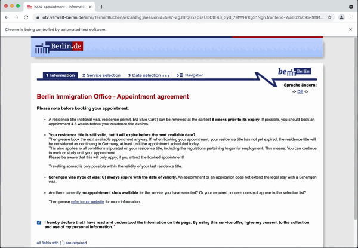
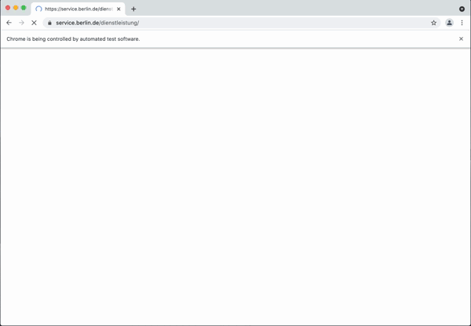

# Berlin Service-Portal Bots

Bots that book available online appointments.

### Installing

Install the required libraries:
```
make install
```

### Auslanderbehörde Bot

The **Auslanderbehörde bot** can book appointments for:
- Apply or extend a residence permit
- Transfer the residence permit to a new passport
- Apply for a settlement permit



Running the Ausländerbehörde bot:
```
make auslanderbehorde
```

### Service-Portal Bot

The **Service-Portal bot** can book appointments for any service it offers online appointments, e.g. `Anmeldung einer Wohnung`, `Führungszeugnis beantragen`.



Running the Service-Portal bot:
```
make service_portal
```

### Configuring

Run the bot and answer its questions. The bot will persist and use the answers on the next executions.

All answers are saved at `.cfg` file.